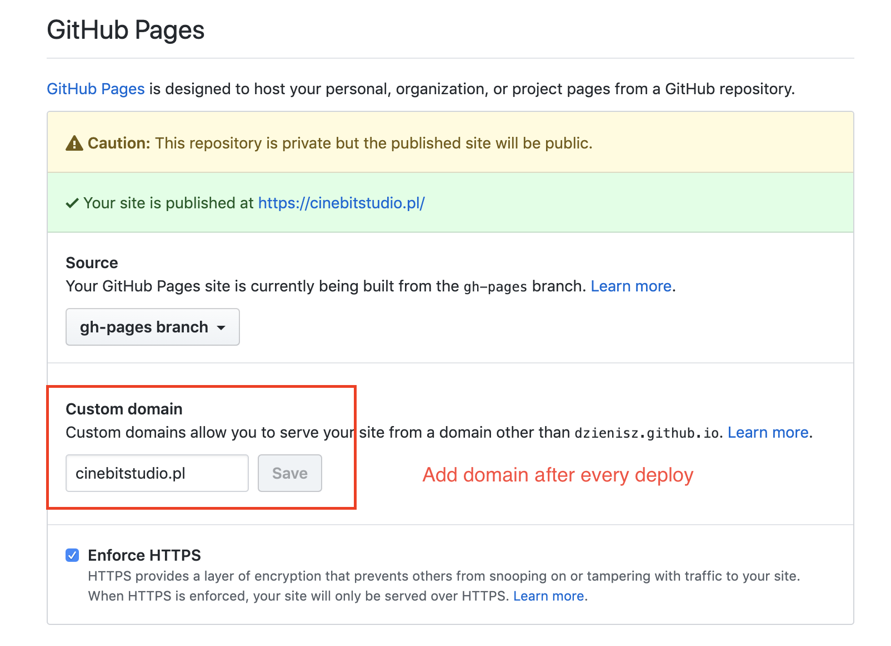

# Cinebit Studio - Website

This project was bootstrapped with [Create React App](https://github.com/facebook/create-react-app).

## Development

1. Make changes
1. Commit
1. Deploy

## How to add new videos?

1. Edit [PORTFOLIO.js](src/PORTFOLIO.js)
1. Edit [MODAL.js](src/MODAL.js)
1. Commit
1. Deploy

## Deploy

1. After you push last commit just run `npm run deploy`
1. It will push your build to GitHub Pages
1. Then you need update domain `cinebitstudio.pl` link on https://github.com/dzienisz/cinebit-studio-website/settings


```
this can be probably fixed by code, by now you need to do it evertime you deploy - https://github.com/tschaub/gh-pages/issues/347
```


